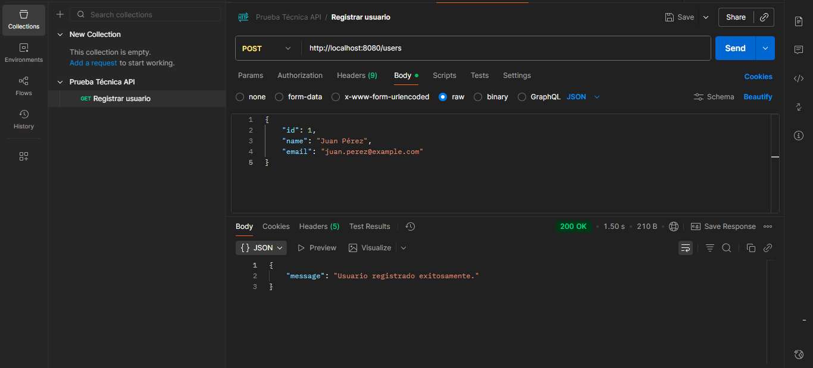
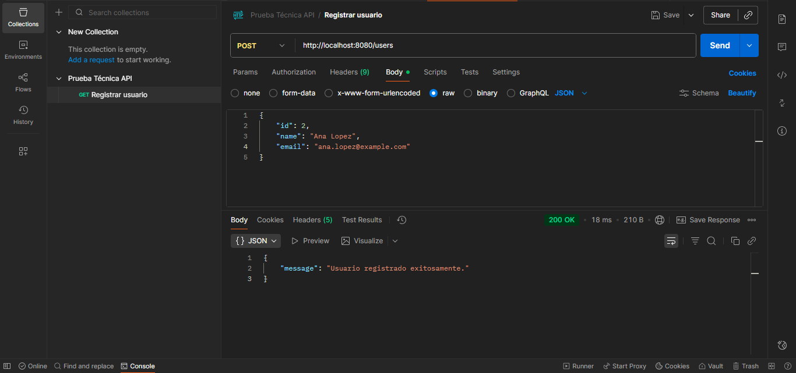
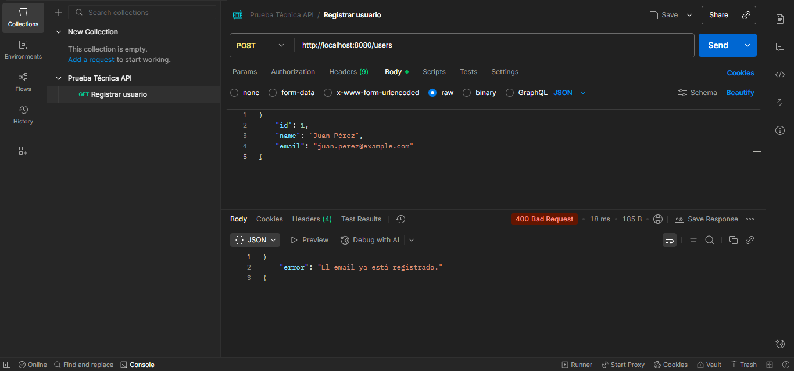
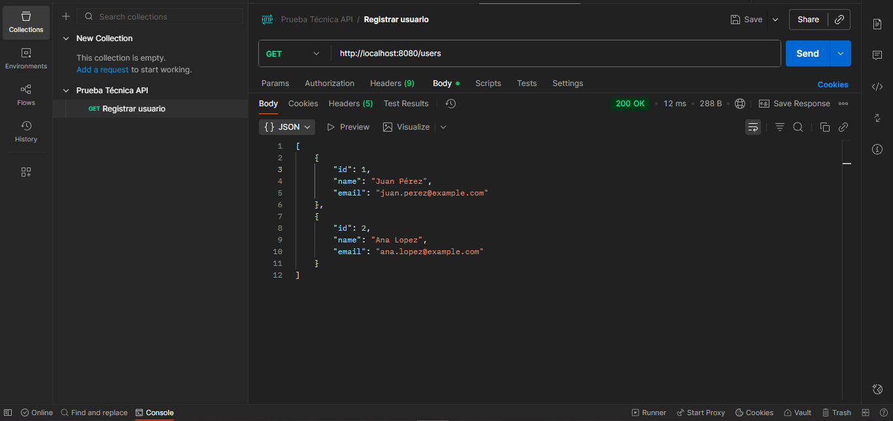

# API REST - Prueba técnica

Servicio básico de API REST desarrollado con Spring Boot que permite registrar y consultar usuarios, los cuales son almacenados temporalmente en la memoria interna.

## Tecnologías utilizadas

  - Java 17
  - Spring Boot 3.5.6
  - Maven
  - Spring Web

## Instalación y ejecución

### Prerrequisitos

  - Java 11 o superior
  - Maven 3.6+

  ### Pasos
  
1.  Clonar el repositorio

```console
git clone https://github.com/Karla874/git_prueba_api
cd git_prueba_api
```
    
2.  Compilar

```console
mvn clean install
```
    
3.  Ejecutar

```console
mvn spring-boot:run
```

4.  Acceder al endpoint
```console
http://localhost:8080/
```
> [!NOTE]
Verificar que se encuentre activa en status.

### Ingresando usuarios:
En una nueva terminal, añadir a...

```console
curl -X POST http://localhost:8080/users \
  -H "Content-Type: application/json" \
  -d '{"id": 1, "name": "Juan Peréz", "email": "juan.perez@example.com"}'
```

```console
curl -X POST http://localhost:8080/users \
  -H "Content-Type: application/json" \
  -d '{"id": 2, "name": "Ana López", "email": "ana.lopez@example.com"}'
```
> [!CAUTION]
Al añadir un usuario con el mismo correo, la terminal debería enseñar un error.

## Extra: Demostración en Postman
Capturas realizadas para corroborar la funcionalidad de la api.
Al hacer clic se pueden ver en tamaño completo.

### Añadir usuarios con POST
 

### Validación de email único


### Consultar usuarios con GET


